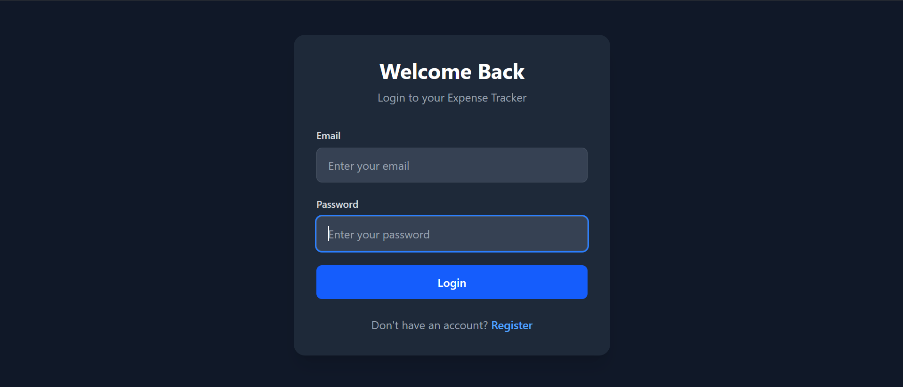
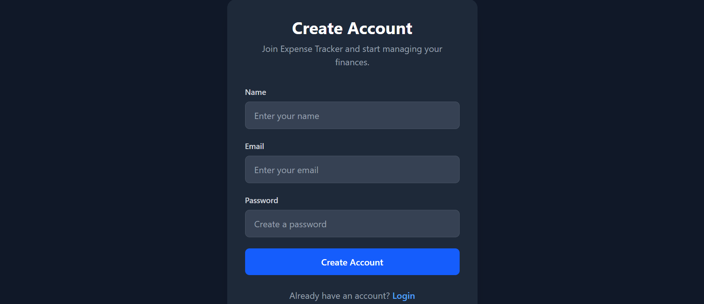
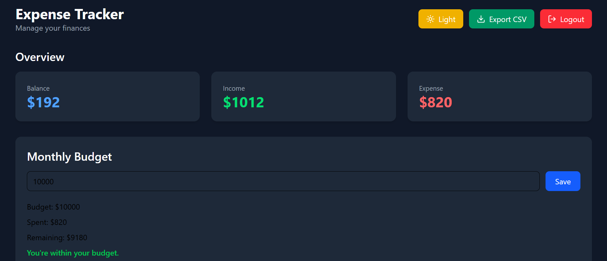
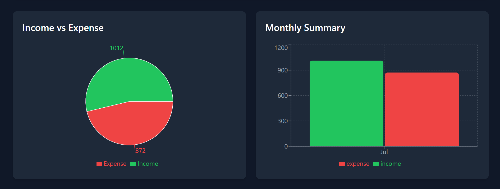
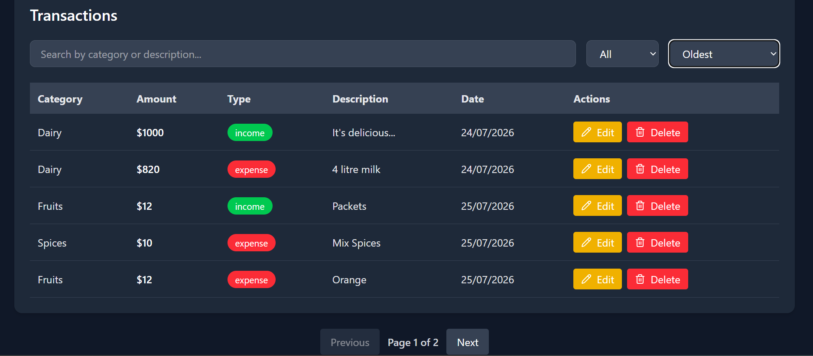
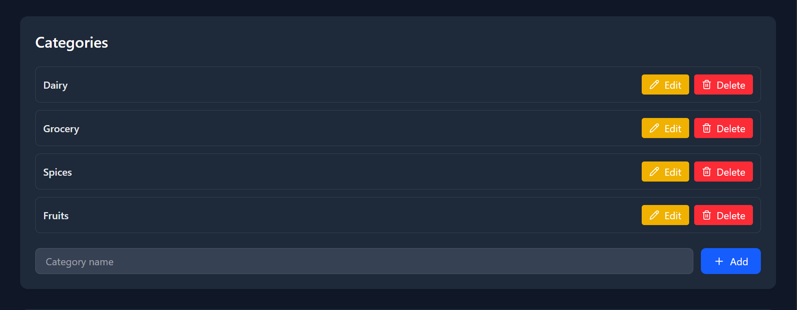
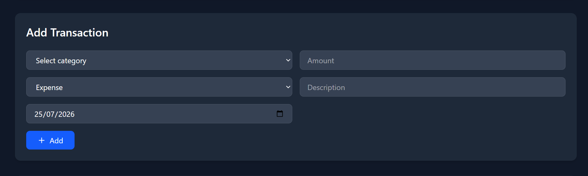

# 💰 Expense Tracker (MERN)


A production-style **Expense Tracker** built with the **MERN Stack** that enables users to securely manage their personal finances. Users can register, authenticate using JWT, organize transactions into categories, monitor monthly budgets, visualize financial data through interactive charts, export transaction history to CSV, and manage their expenses through a clean and responsive interface.

---

# ⭐ Highlights

- Secure JWT Authentication with HTTP-only Cookies
- Protected REST API Routes
- Monthly Budget Management
- Income & Expense Tracking
- Interactive Financial Charts using Recharts
- Transaction Search, Filtering & Sorting
- CSV Export Functionality
- Dark Mode Support
- Responsive User Interface
- RESTful API Design
- MVC Backend Architecture
- MongoDB Atlas Integration
- Joi Request Validation
- Secure Backend using Helmet & Rate Limiting

---

# 🌐 Live Demo

🚀 **Live Application**

- 🌐 Frontend: <https://expense-tracker-mern-bay.vercel.app/>
- ⚙️ Backend API: <https://expense-tracker-mern-kh5b.onrender.com/>

> **Note**
>
> The frontend is deployed on **Vercel** and the backend is hosted on **Render**.
>
> Since Render uses a free tier, the first request after inactivity may take **30–60 seconds** while the server wakes up.

---

# 🎯 Project Overview

Expense Tracker was built to strengthen my understanding of full-stack application development using the MERN stack.

Rather than creating a simple CRUD application, the goal was to build a production-style project implementing modern backend architecture, secure authentication, reusable React components, data visualization, API security, and responsive UI design.

The application demonstrates many real-world concepts commonly used in modern web development.

---

# 🏛 Architecture

The project follows a modular architecture.

## Backend (MVC)

- Models
- Controllers
- Routes
- Middleware
- Validation Schemas
- REST API

## Frontend

- Pages
- Reusable Components
- Utility Functions
- API Layer
- React Hooks
- Component-based UI

---

# 📸 Screenshots

## 🔐 Login



---

## 📝 Register



---

## 📊 Dashboard



---

## 📈 Charts



---

## 💳 Transactions



---

## 📂 Categories



---

## 🌙 Dark Mode



---

# ✨ Features

## 🔐 Authentication

- User Registration
- User Login
- Secure Logout
- JWT Authentication
- HTTP-only Cookie Authentication
- Protected Routes

---

## 💳 Transaction Management

- Add Transactions
- Update Transactions
- Delete Transactions
- Income Tracking
- Expense Tracking
- Description Support
- Date Selection
- Transaction Validation

---

## 📂 Category Management

- Create Categories
- Edit Categories
- Delete Categories
- Prevent deleting categories currently used by transactions

---

## 📊 Dashboard

- Current Balance
- Total Income
- Total Expenses
- Monthly Budget
- Budget Progress Tracking

---

## 📈 Analytics

- Income vs Expense Pie Chart
- Monthly Summary Bar Chart

---

## 🔍 Productivity

- Search Transactions
- Filter by Transaction Type
- Sort by

  - Latest
  - Oldest
  - Highest Amount
  - Lowest Amount

- Pagination

---

## 📥 Export

- Export Transactions to CSV

---

## 🎨 User Experience

- Responsive Design
- Dark Mode
- Toast Notifications
- Delete Confirmation Modal
- Modern UI using Tailwind CSS

---

# 🛠 Tech Stack

| Category | Technologies |
|-----------|--------------|
| **Frontend** | React, React Router, Tailwind CSS |
| **Charts** | Recharts |
| **Icons** | Lucide React |
| **Notifications** | React Hot Toast |
| **Backend** | Node.js, Express.js |
| **Database** | MongoDB Atlas, Mongoose |
| **Authentication** | JWT, HTTP-only Cookies |
| **Validation** | Joi |
| **Security** | Helmet, CORS, Express Rate Limit |
| **Utilities** | Cookie Parser |
| **Deployment** | Vercel (Frontend), Render (Backend) |
| **Version Control** | Git, GitHub |

---

# 📂 Project Structure

```text
expense-tracker/
├── client/
│   ├── public/
│   ├── src/
│   │
│   ├── assets/
│   │
│   ├── components/
│   │   ├── BudgetCard.jsx
│   │   ├── CategorySection.jsx
│   │   ├── ChartsSection.jsx
│   │   ├── ConfirmModal.jsx
│   │   ├── OverviewCards.jsx
│   │   ├── Pagination.jsx
│   │   ├── TransactionForm.jsx
│   │   └── TransactionTable.jsx
│   │
│   ├── pages/
│   │   ├── Dashboard.jsx
│   │   ├── Login.jsx
│   │   └── Register.jsx
│   │
│   ├── utils/
│   │   └── exportCSV.js
│   │
│   ├── App.jsx
│   └── main.jsx
│
├── server/
│   ├── controllers/
│   │   ├── authController.js
│   │   ├── budgetController.js
│   │   ├── categoryController.js
│   │   ├── dashboardController.js
│   │   └── transactionController.js
│   │
│   ├── middleware/
│   │   ├── asyncWrapper.js
│   │   ├── errorHandler.js
│   │   ├── protect.js
│   │   └── validate.js
│   │
│   ├── models/
│   │   ├── Budget.js
│   │   ├── Category.js
│   │   ├── Transaction.js
│   │   └── User.js
│   │
│   ├── routes/
│   │   ├── auth.js
│   │   ├── budgetRoutes.js
│   │   ├── categories.js
│   │   ├── dashboard.js
│   │   └── transactions.js
│   │
│   ├── schemas/
│   │   ├── authSchemas.js
│   │   ├── categorySchemas.js
│   │   └── transactionSchemas.js
│   │
│   ├── server.js
│   └── package.json
│
├── screenshots/
│
├── README.md
└── .gitignore
```

# 🚀 Installation

## 1. Clone the Repository

```bash
git clone https://github.com/Akbarhussain973/expense-tracker-mern.git
```

---

## 2. Navigate into the Project

```bash
cd expense-tracker-mern
```

---

## 3. Install Dependencies

### Backend

```bash
cd server
npm install
```

### Frontend

```bash
cd ../client
npm install
```

---

## 4. Configure Environment Variables

### Backend (`server/.env`)

```env
PORT=3000
MONGO_URI=your_mongodb_connection_string
JWT_SECRET=your_secret_key
# Local Development
CLIENT_URL=http://localhost:5173
# Production
CLIENT_URL=https://expense-tracker-mern-bay.vercel.app
NODE_ENV=development
```

### Frontend (`client/.env`)

```env
# Local Development
VITE_API_URL=http://localhost:3000
```

For production (Vercel), configure:

```env
VITE_API_URL=/api
```

> **Note:** For local development, point `VITE_API_URL` to your local backend (for example `http://localhost:3000`). For production with the Vercel reverse proxy, use `/api`.
> 
> Never commit your `.env` files to GitHub. They contain sensitive credentials.

---

## 5. Start the Application

### Start Backend

```bash
cd server
npm run dev
```

### Start Frontend

```bash
cd client
npm run dev
```

Open your browser and visit:

```text
http://localhost:5173
```

---

# 🚀 Deployment

The application is deployed using:

- Frontend: Vercel
- Backend: Render
- Database: MongoDB Atlas

The frontend communicates with the backend through a Vercel reverse proxy (`/api`), enabling secure HTTP-only cookie authentication while keeping backend endpoints hidden from the client.

---

# 📚 What I Learned

Building this project strengthened my understanding of modern full-stack web development and production-style application architecture.

Throughout this project I learned:

- Building a complete MERN stack application
- Designing RESTful APIs with Express.js
- JWT Authentication using HTTP-only Cookies
- Protecting routes using custom authentication middleware
- Password hashing using bcrypt
- Building secure authentication flows
- Creating reusable React components
- React Hooks (`useState`, `useEffect`, `useMemo`, `useRef`)
- State-driven UI development
- CRUD operations with React and Express
- MongoDB schema design with Mongoose
- Designing relationships between collections
- Organizing backend code using MVC Architecture
- Controller-based route organization
- Request validation using Joi
- Centralized error handling
- Async controller patterns
- Backend security using Helmet, CORS and Rate Limiting
- Building interactive charts with Recharts
- Implementing Search, Filtering, Sorting and Pagination
- Exporting application data as CSV
- Budget tracking logic
- Dark Mode implementation using Tailwind CSS
- Building responsive user interfaces
- Environment variable management
- Git & GitHub workflow
- Writing clean, maintainable and modular code

---

# 🔮 Future Improvements

- Recurring Transactions
- Budget Notifications
- Spending Goals
- Financial Reports
- Category-wise Analytics
- Multi-Currency Support
- User Profile
- Email Verification
- Password Reset
- Profile Pictures
- Receipt Uploads
- AI-powered Spending Insights
- Progressive Web App (PWA)
- Mobile Application

---

# 📄 License

This project is licensed under the **MIT License**.

---

# 👨‍💻 Author

**Akbar Hussain**

Software Engineering Student

FAST National University of Computer and Emerging Sciences (FAST-NUCES)

Aspiring MERN Stack & AI Engineer

### GitHub

https://github.com/Akbarhussain973

### Live Demo

- 🌐 Frontend: <https://expense-tracker-mern-bay.vercel.app/>
- ⚙️ Backend API: <https://expense-tracker-mern-kh5b.onrender.com/>

---

# 🙏 Acknowledgements

Special thanks to the open-source community and the creators of React, Express.js, MongoDB, Tailwind CSS, Recharts, and the many libraries that made this project possible.

---

## ⭐ Support

If you found this project useful or learned something from it, consider giving it a **Star ⭐** on GitHub.

It helps support the project and motivates me to continue building and sharing more projects.

---

**Made with ❤️ using the MERN Stack**


